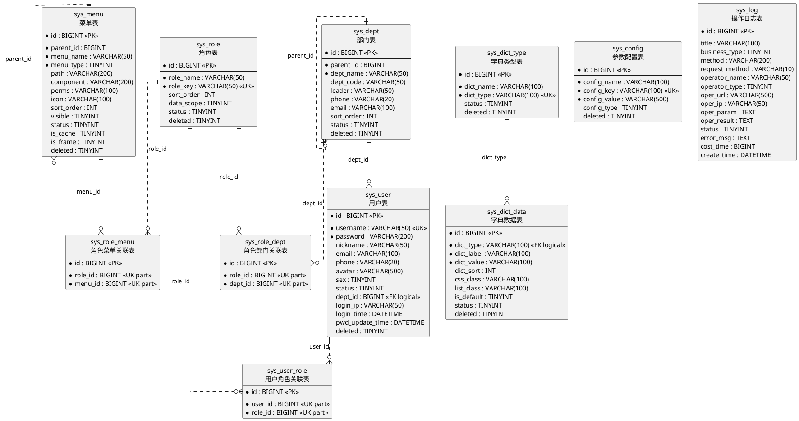

# MIS 系统管理模块-数据库详细设计文档

文档版本：V1.0  
编制日期：2026-05-02  
数据库类型：MySQL 8.0，字符集 `utf8mb4`  
迁移工具：Flyway  
逆向依据：`mis-system/src/main/resources/db/migration/V1__init_sys_user.sql` 至 `V8__init_relation_tables.sql`

## 1. 设计概述

### 1.1 编写目的

本文档从现有 Flyway 迁移脚本反向整理 MIS 系统管理模块数据库详细设计，覆盖数据域划分、表清单、字段定义、索引约束、初始化数据、ER 图 PlantUML 源码和后续扩展建议。

### 1.2 设计原则

| 原则 | 说明 |
| --- | --- |
| 统一命名 | 系统管理表统一使用 `sys_` 前缀，字段使用 snake_case |
| 统一主键 | 主键统一为 `BIGINT AUTO_INCREMENT` |
| 逻辑删除 | 业务主表普遍包含 `deleted`，`0` 正常，`1` 删除 |
| 审计字段 | 主业务表包含 `create_time`、`update_time`、`create_by`、`update_by` |
| 字符集 | 全部表使用 `utf8mb4` |
| 版本管理 | 表结构通过 Flyway V1-V8 管理 |
| 查询优化 | 常用筛选字段、关系字段和唯一业务键建立索引 |

### 1.3 数据库配置

| 项 | 值 |
| --- | --- |
| 数据库 | `mis_admin` |
| 本地端口 | `13306:3306` |
| Flyway 位置 | `classpath:db/migration` |
| Flyway 历史表 | `flyway_schema_history` |
| MyBatis-Plus 命名 | `map-underscore-to-camel-case=true` |
| 逻辑删除字段 | `deleted` |
| 逻辑删除值 | `1` |
| 逻辑未删除值 | `0` |

## 2. 数据域与表清单

| 数据域 | 表名 | 中文名 | 迁移脚本 | 说明 |
| --- | --- | --- | --- | --- |
| 用户域 | `sys_user` | 用户表 | V1 | 系统账号、密码、状态、部门归属 |
| 权限域 | `sys_role` | 角色表 | V2 | 角色定义、角色标识、数据范围 |
| 权限域 | `sys_menu` | 菜单表 | V3 | 目录、菜单、按钮和权限标识 |
| 组织域 | `sys_dept` | 部门表 | V4 | 部门树和组织架构 |
| 字典域 | `sys_dict_type` | 字典类型表 | V5 | 字典类型元数据 |
| 字典域 | `sys_dict_data` | 字典数据表 | V5 | 字典项、显示样式、默认项 |
| 审计域 | `sys_log` | 操作日志表 | V6 | 后台操作审计记录 |
| 配置域 | `sys_config` | 参数配置表 | V7 | 系统配置键值 |
| 关系域 | `sys_user_role` | 用户角色关联表 | V8 | 用户和角色多对多 |
| 关系域 | `sys_role_menu` | 角色菜单关联表 | V8 | 角色和菜单/按钮多对多 |
| 关系域 | `sys_role_dept` | 角色部门关联表 | V8 | 自定义数据权限部门范围 |

## 3. ER 图 PlantUML 源码

> 说明：当前迁移脚本未声明外键，以下 ER 图按业务语义表达逻辑关系。实际数据库通过普通索引和唯一索引约束关系表。

## 4. 表结构详细设计

### 4.1 `sys_user` 用户表

用途：保存后台账号基础信息、密码、状态、部门归属、登录信息和审计字段。

| 字段 | 类型 | 必填 | 默认值 | 键/索引 | 说明 |
| --- | --- | --- | --- | --- | --- |
| `id` | `BIGINT` | 是 | 自增 | PK | 主键 ID |
| `username` | `VARCHAR(50)` | 是 | 无 | UK | 用户名，唯一 |
| `password` | `VARCHAR(200)` | 是 | 无 |  | BCrypt 加密密码 |
| `nickname` | `VARCHAR(50)` | 否 | `''` |  | 昵称 |
| `email` | `VARCHAR(100)` | 否 | `''` |  | 邮箱 |
| `phone` | `VARCHAR(20)` | 否 | `''` | IDX | 手机号 |
| `avatar` | `VARCHAR(500)` | 否 | `''` |  | 头像地址 |
| `sex` | `TINYINT` | 否 | `0` |  | 性别：0 未知，1 男，2 女 |
| `status` | `TINYINT` | 是 | `1` | IDX | 状态：0 禁用，1 启用 |
| `dept_id` | `BIGINT` | 否 | `NULL` | IDX | 部门 ID，逻辑关联 `sys_dept.id` |
| `remark` | `VARCHAR(500)` | 否 | `''` |  | 备注 |
| `login_ip` | `VARCHAR(50)` | 否 | `''` |  | 最后登录 IP |
| `login_time` | `DATETIME` | 否 | `NULL` |  | 最后登录时间 |
| `pwd_update_time` | `DATETIME` | 否 | `NULL` |  | 密码最后更新时间 |
| `create_time` | `DATETIME` | 是 | `CURRENT_TIMESTAMP` |  | 创建时间 |
| `update_time` | `DATETIME` | 是 | `CURRENT_TIMESTAMP ON UPDATE CURRENT_TIMESTAMP` |  | 更新时间 |
| `create_by` | `VARCHAR(64)` | 否 | `''` |  | 创建人 |
| `update_by` | `VARCHAR(64)` | 否 | `''` |  | 更新人 |
| `deleted` | `TINYINT` | 是 | `0` |  | 逻辑删除 |

索引与约束：

| 名称 | 类型 | 字段 | 目的 |
| --- | --- | --- | --- |
| `PRIMARY` | 主键 | `id` | 主键定位 |
| `uk_sys_user_username` | 唯一索引 | `username` | 保证用户名唯一 |
| `idx_sys_user_dept_id` | 普通索引 | `dept_id` | 部门筛选 |
| `idx_sys_user_status` | 普通索引 | `status` | 状态筛选 |
| `idx_sys_user_phone` | 普通索引 | `phone` | 手机号查询 |

初始化数据：插入 `admin` 超级管理员账号，密码为 BCrypt 密文。

### 4.2 `sys_role` 角色表

用途：定义后台角色及其数据权限范围。

| 字段 | 类型 | 必填 | 默认值 | 键/索引 | 说明 |
| --- | --- | --- | --- | --- | --- |
| `id` | `BIGINT` | 是 | 自增 | PK | 主键 ID |
| `role_name` | `VARCHAR(50)` | 是 | 无 |  | 角色名称 |
| `role_key` | `VARCHAR(50)` | 是 | 无 | UK | 角色标识 |
| `sort_order` | `INT` | 是 | `0` |  | 排序 |
| `data_scope` | `TINYINT` | 是 | `1` |  | 数据范围 |
| `status` | `TINYINT` | 是 | `1` | IDX | 状态：0 禁用，1 启用 |
| `remark` | `VARCHAR(500)` | 否 | `''` |  | 备注 |
| `create_time` | `DATETIME` | 是 | `CURRENT_TIMESTAMP` |  | 创建时间 |
| `update_time` | `DATETIME` | 是 | `CURRENT_TIMESTAMP ON UPDATE CURRENT_TIMESTAMP` |  | 更新时间 |
| `create_by` | `VARCHAR(64)` | 否 | `''` |  | 创建人 |
| `update_by` | `VARCHAR(64)` | 否 | `''` |  | 更新人 |
| `deleted` | `TINYINT` | 是 | `0` |  | 逻辑删除 |

数据范围枚举：

| 值 | 含义 |
| --- | --- |
| `1` | 全部数据权限 |
| `2` | 本部门数据权限 |
| `3` | 本部门及下级数据权限 |
| `4` | 仅本人数据权限 |
| `5` | 自定义数据权限 |

索引与约束：

| 名称 | 类型 | 字段 | 目的 |
| --- | --- | --- | --- |
| `PRIMARY` | 主键 | `id` | 主键定位 |
| `uk_sys_role_key` | 唯一索引 | `role_key` | 保证角色标识唯一 |
| `idx_sys_role_status` | 普通索引 | `status` | 状态筛选 |

初始化数据：超级管理员 `admin`、普通管理员 `common`、普通用户 `user`。

### 4.3 `sys_menu` 菜单表

用途：统一保存目录、菜单、按钮权限和动态路由信息。

| 字段 | 类型 | 必填 | 默认值 | 键/索引 | 说明 |
| --- | --- | --- | --- | --- | --- |
| `id` | `BIGINT` | 是 | 自增 | PK | 主键 ID |
| `parent_id` | `BIGINT` | 是 | `0` | IDX | 父菜单 ID |
| `menu_name` | `VARCHAR(50)` | 是 | 无 |  | 菜单名称 |
| `menu_type` | `TINYINT` | 是 | 无 |  | 类型：1 目录，2 菜单，3 按钮 |
| `path` | `VARCHAR(200)` | 否 | `''` |  | 路由地址 |
| `component` | `VARCHAR(200)` | 否 | `''` |  | 组件路径 |
| `perms` | `VARCHAR(100)` | 否 | `''` |  | 权限标识 |
| `icon` | `VARCHAR(100)` | 否 | `''` |  | 菜单图标 |
| `sort_order` | `INT` | 是 | `0` |  | 排序 |
| `visible` | `TINYINT` | 是 | `1` |  | 是否显示：0 隐藏，1 显示 |
| `status` | `TINYINT` | 是 | `1` | IDX | 状态：0 禁用，1 启用 |
| `is_cache` | `TINYINT` | 是 | `0` |  | 是否缓存：0 否，1 是 |
| `is_frame` | `TINYINT` | 是 | `0` |  | 是否外链：0 否，1 是 |
| `remark` | `VARCHAR(500)` | 否 | `''` |  | 备注 |
| `create_time` | `DATETIME` | 是 | `CURRENT_TIMESTAMP` |  | 创建时间 |
| `update_time` | `DATETIME` | 是 | `CURRENT_TIMESTAMP ON UPDATE CURRENT_TIMESTAMP` |  | 更新时间 |
| `create_by` | `VARCHAR(64)` | 否 | `''` |  | 创建人 |
| `update_by` | `VARCHAR(64)` | 否 | `''` |  | 更新人 |
| `deleted` | `TINYINT` | 是 | `0` |  | 逻辑删除 |

索引与约束：

| 名称 | 类型 | 字段 | 目的 |
| --- | --- | --- | --- |
| `PRIMARY` | 主键 | `id` | 主键定位 |
| `idx_sys_menu_parent_id` | 普通索引 | `parent_id` | 菜单树查询 |
| `idx_sys_menu_status` | 普通索引 | `status` | 状态筛选 |

初始化数据：系统管理目录、用户管理、角色管理、菜单管理、部门管理，以及用户查询/新增/编辑/删除按钮权限。

### 4.4 `sys_dept` 部门表

用途：保存组织架构树。

| 字段 | 类型 | 必填 | 默认值 | 键/索引 | 说明 |
| --- | --- | --- | --- | --- | --- |
| `id` | `BIGINT` | 是 | 自增 | PK | 主键 ID |
| `parent_id` | `BIGINT` | 是 | `0` | IDX | 父部门 ID |
| `dept_name` | `VARCHAR(50)` | 是 | 无 |  | 部门名称 |
| `dept_code` | `VARCHAR(50)` | 否 | `''` |  | 部门编码 |
| `leader` | `VARCHAR(50)` | 否 | `''` |  | 负责人 |
| `phone` | `VARCHAR(20)` | 否 | `''` |  | 联系电话 |
| `email` | `VARCHAR(100)` | 否 | `''` |  | 邮箱 |
| `sort_order` | `INT` | 是 | `0` |  | 排序 |
| `status` | `TINYINT` | 是 | `1` | IDX | 状态 |
| `create_time` | `DATETIME` | 是 | `CURRENT_TIMESTAMP` |  | 创建时间 |
| `update_time` | `DATETIME` | 是 | `CURRENT_TIMESTAMP ON UPDATE CURRENT_TIMESTAMP` |  | 更新时间 |
| `create_by` | `VARCHAR(64)` | 否 | `''` |  | 创建人 |
| `update_by` | `VARCHAR(64)` | 否 | `''` |  | 更新人 |
| `deleted` | `TINYINT` | 是 | `0` |  | 逻辑删除 |

索引与约束：

| 名称 | 类型 | 字段 | 目的 |
| --- | --- | --- | --- |
| `PRIMARY` | 主键 | `id` | 主键定位 |
| `idx_sys_dept_parent_id` | 普通索引 | `parent_id` | 部门树查询 |
| `idx_sys_dept_status` | 普通索引 | `status` | 状态筛选 |

初始化数据：总公司、技术部、市场部、财务部、前端组、后端组。

### 4.5 `sys_dict_type` 字典类型表

用途：定义字典类型编码。

| 字段 | 类型 | 必填 | 默认值 | 键/索引 | 说明 |
| --- | --- | --- | --- | --- | --- |
| `id` | `BIGINT` | 是 | 自增 | PK | 主键 ID |
| `dict_name` | `VARCHAR(100)` | 是 | 无 |  | 字典名称 |
| `dict_type` | `VARCHAR(100)` | 是 | 无 | UK | 字典类型编码 |
| `status` | `TINYINT` | 是 | `1` |  | 状态 |
| `remark` | `VARCHAR(500)` | 否 | `''` |  | 备注 |
| `create_time` | `DATETIME` | 是 | `CURRENT_TIMESTAMP` |  | 创建时间 |
| `update_time` | `DATETIME` | 是 | `CURRENT_TIMESTAMP ON UPDATE CURRENT_TIMESTAMP` |  | 更新时间 |
| `create_by` | `VARCHAR(64)` | 否 | `''` |  | 创建人 |
| `update_by` | `VARCHAR(64)` | 否 | `''` |  | 更新人 |
| `deleted` | `TINYINT` | 是 | `0` |  | 逻辑删除 |

索引与约束：

| 名称 | 类型 | 字段 | 目的 |
| --- | --- | --- | --- |
| `PRIMARY` | 主键 | `id` | 主键定位 |
| `uk_sys_dict_type` | 唯一索引 | `dict_type` | 保证字典类型唯一 |

### 4.6 `sys_dict_data` 字典数据表

用途：定义字典项。

| 字段 | 类型 | 必填 | 默认值 | 键/索引 | 说明 |
| --- | --- | --- | --- | --- | --- |
| `id` | `BIGINT` | 是 | 自增 | PK | 主键 ID |
| `dict_type` | `VARCHAR(100)` | 是 | 无 | IDX | 字典类型 |
| `dict_label` | `VARCHAR(100)` | 是 | 无 |  | 字典标签 |
| `dict_value` | `VARCHAR(100)` | 是 | 无 |  | 字典值 |
| `dict_sort` | `INT` | 是 | `0` |  | 排序 |
| `css_class` | `VARCHAR(100)` | 否 | `''` |  | 样式属性 |
| `list_class` | `VARCHAR(100)` | 否 | `''` |  | 表格回显样式 |
| `is_default` | `TINYINT` | 是 | `0` |  | 是否默认 |
| `status` | `TINYINT` | 是 | `1` |  | 状态 |
| `remark` | `VARCHAR(500)` | 否 | `''` |  | 备注 |
| `create_time` | `DATETIME` | 是 | `CURRENT_TIMESTAMP` |  | 创建时间 |
| `update_time` | `DATETIME` | 是 | `CURRENT_TIMESTAMP ON UPDATE CURRENT_TIMESTAMP` |  | 更新时间 |
| `create_by` | `VARCHAR(64)` | 否 | `''` |  | 创建人 |
| `update_by` | `VARCHAR(64)` | 否 | `''` |  | 更新人 |
| `deleted` | `TINYINT` | 是 | `0` |  | 逻辑删除 |

索引与约束：

| 名称 | 类型 | 字段 | 目的 |
| --- | --- | --- | --- |
| `PRIMARY` | 主键 | `id` | 主键定位 |
| `idx_sys_dict_data_type` | 普通索引 | `dict_type` | 按类型查询字典项 |

初始化字典：

| 字典类型 | 字典项 |
| --- | --- |
| `sys_user_status` | 启用 `1`、禁用 `0` |
| `sys_user_sex` | 男 `1`、女 `2`、未知 `0` |
| `sys_menu_type` | 当前仅初始化类型，未插入具体项 |
| `sys_yes_no` | 是 `1`、否 `0` |

### 4.7 `sys_log` 操作日志表

用途：保存后台操作审计日志。

| 字段 | 类型 | 必填 | 默认值 | 键/索引 | 说明 |
| --- | --- | --- | --- | --- | --- |
| `id` | `BIGINT` | 是 | 自增 | PK | 主键 ID |
| `title` | `VARCHAR(100)` | 否 | `''` |  | 操作标题 |
| `business_type` | `TINYINT` | 是 | `0` | IDX | 业务类型：0 其他，1 新增，2 修改，3 删除 |
| `method` | `VARCHAR(200)` | 否 | `''` |  | 方法名称 |
| `request_method` | `VARCHAR(10)` | 否 | `''` |  | 请求方式 |
| `operator_name` | `VARCHAR(50)` | 否 | `''` | IDX | 操作人 |
| `operator_type` | `TINYINT` | 否 | `0` |  | 操作人类型：0 其他，1 后台用户 |
| `oper_url` | `VARCHAR(500)` | 否 | `''` |  | 请求 URL |
| `oper_ip` | `VARCHAR(50)` | 否 | `''` |  | 主机地址 |
| `oper_param` | `TEXT` | 否 | `NULL` |  | 请求参数 |
| `oper_result` | `TEXT` | 否 | `NULL` |  | 返回参数 |
| `status` | `TINYINT` | 是 | `1` | IDX | 操作状态：0 异常，1 正常 |
| `error_msg` | `TEXT` | 否 | `NULL` |  | 错误消息 |
| `cost_time` | `BIGINT` | 否 | `0` |  | 耗时，单位毫秒 |
| `create_time` | `DATETIME` | 是 | `CURRENT_TIMESTAMP` | IDX | 创建时间 |

索引与约束：

| 名称 | 类型 | 字段 | 目的 |
| --- | --- | --- | --- |
| `PRIMARY` | 主键 | `id` | 主键定位 |
| `idx_sys_log_business_type` | 普通索引 | `business_type` | 按业务类型查询 |
| `idx_sys_log_operator` | 普通索引 | `operator_name` | 按操作人查询 |
| `idx_sys_log_create_time` | 普通索引 | `create_time` | 按时间范围查询 |
| `idx_sys_log_status` | 普通索引 | `status` | 按成功/异常查询 |

### 4.8 `sys_config` 参数配置表

用途：保存系统参数。

| 字段 | 类型 | 必填 | 默认值 | 键/索引 | 说明 |
| --- | --- | --- | --- | --- | --- |
| `id` | `BIGINT` | 是 | 自增 | PK | 主键 ID |
| `config_name` | `VARCHAR(100)` | 是 | 无 |  | 参数名称 |
| `config_key` | `VARCHAR(100)` | 是 | 无 | UK | 参数键名 |
| `config_value` | `VARCHAR(500)` | 是 | 无 |  | 参数键值 |
| `config_type` | `TINYINT` | 是 | `1` |  | 是否系统内置：1 是，0 否 |
| `remark` | `VARCHAR(500)` | 否 | `''` |  | 备注 |
| `create_time` | `DATETIME` | 是 | `CURRENT_TIMESTAMP` |  | 创建时间 |
| `update_time` | `DATETIME` | 是 | `CURRENT_TIMESTAMP ON UPDATE CURRENT_TIMESTAMP` |  | 更新时间 |
| `create_by` | `VARCHAR(64)` | 否 | `''` |  | 创建人 |
| `update_by` | `VARCHAR(64)` | 否 | `''` |  | 更新人 |
| `deleted` | `TINYINT` | 是 | `0` |  | 逻辑删除 |

索引与约束：

| 名称 | 类型 | 字段 | 目的 |
| --- | --- | --- | --- |
| `PRIMARY` | 主键 | `id` | 主键定位 |
| `uk_sys_config_key` | 唯一索引 | `config_key` | 保证配置键唯一 |

初始化配置：

| 配置键 | 配置值 | 说明 |
| --- | --- | --- |
| `sys.index.title` | `MIS系统管理平台` | 系统首页标题 |
| `sys.user.initPassword` | `123456` | 新用户默认密码 |
| `sys.account.register` | `false` | 是否开启自动注册 |
| `sys.captcha.enabled` | `true` | 登录是否开启验证码 |
| `sys.password.minLength` | `8` | 密码最小长度 |
| `sys.password.maxLength` | `20` | 密码最大长度 |

### 4.9 `sys_user_role` 用户角色关联表

用途：保存用户与角色多对多关系。

| 字段 | 类型 | 必填 | 默认值 | 键/索引 | 说明 |
| --- | --- | --- | --- | --- | --- |
| `id` | `BIGINT` | 是 | 自增 | PK | 主键 ID |
| `user_id` | `BIGINT` | 是 | 无 | IDX/UK | 用户 ID，逻辑关联 `sys_user.id` |
| `role_id` | `BIGINT` | 是 | 无 | IDX/UK | 角色 ID，逻辑关联 `sys_role.id` |

索引与约束：

| 名称 | 类型 | 字段 | 目的 |
| --- | --- | --- | --- |
| `PRIMARY` | 主键 | `id` | 主键定位 |
| `idx_sys_user_role_user_id` | 普通索引 | `user_id` | 查询用户角色 |
| `idx_sys_user_role_role_id` | 普通索引 | `role_id` | 查询角色用户 |
| `uk_sys_user_role` | 唯一索引 | `user_id, role_id` | 防止重复分配 |

初始化数据：用户 `1` 绑定角色 `1`。

### 4.10 `sys_role_menu` 角色菜单关联表

用途：保存角色与菜单/按钮权限多对多关系。

| 字段 | 类型 | 必填 | 默认值 | 键/索引 | 说明 |
| --- | --- | --- | --- | --- | --- |
| `id` | `BIGINT` | 是 | 自增 | PK | 主键 ID |
| `role_id` | `BIGINT` | 是 | 无 | IDX/UK | 角色 ID |
| `menu_id` | `BIGINT` | 是 | 无 | IDX/UK | 菜单 ID |

索引与约束：

| 名称 | 类型 | 字段 | 目的 |
| --- | --- | --- | --- |
| `PRIMARY` | 主键 | `id` | 主键定位 |
| `idx_sys_role_menu_role_id` | 普通索引 | `role_id` | 查询角色权限 |
| `idx_sys_role_menu_menu_id` | 普通索引 | `menu_id` | 查询菜单授权角色 |
| `uk_sys_role_menu` | 唯一索引 | `role_id, menu_id` | 防止重复授权 |

初始化数据：角色 `1` 授权所有未删除菜单。

### 4.11 `sys_role_dept` 角色部门关联表

用途：保存角色自定义数据权限范围。

| 字段 | 类型 | 必填 | 默认值 | 键/索引 | 说明 |
| --- | --- | --- | --- | --- | --- |
| `id` | `BIGINT` | 是 | 自增 | PK | 主键 ID |
| `role_id` | `BIGINT` | 是 | 无 | IDX/UK | 角色 ID |
| `dept_id` | `BIGINT` | 是 | 无 | IDX/UK | 部门 ID |

索引与约束：

| 名称 | 类型 | 字段 | 目的 |
| --- | --- | --- | --- |
| `PRIMARY` | 主键 | `id` | 主键定位 |
| `idx_sys_role_dept_role_id` | 普通索引 | `role_id` | 查询角色数据范围 |
| `idx_sys_role_dept_dept_id` | 普通索引 | `dept_id` | 查询部门授权角色 |
| `uk_sys_role_dept` | 唯一索引 | `role_id, dept_id` | 防止重复授权 |

## 5. 关系设计

| 关系 | 类型 | 实现方式 | 说明 |
| --- | --- | --- | --- |
| 用户-部门 | 多对一 | `sys_user.dept_id` | 一个用户归属一个部门 |
| 部门-部门 | 自关联一对多 | `sys_dept.parent_id` | 组织树 |
| 菜单-菜单 | 自关联一对多 | `sys_menu.parent_id` | 菜单树 |
| 用户-角色 | 多对多 | `sys_user_role` | 一个用户多个角色，一个角色多个用户 |
| 角色-菜单 | 多对多 | `sys_role_menu` | 角色拥有菜单/按钮权限 |
| 角色-部门 | 多对多 | `sys_role_dept` | 自定义数据权限 |
| 字典类型-字典数据 | 一对多 | `sys_dict_data.dict_type` | 按类型加载字典项 |

## 6. 关键业务数据规则

| 编号 | 规则 | 数据库支撑 | 应用层支撑 |
| --- | --- | --- | --- |
| DBR-001 | 用户名必须唯一 | `uk_sys_user_username` | `ensureUsernameUnique` |
| DBR-002 | 密码不得明文存储 | 字段长度支持 BCrypt | `PasswordEncoder.encode` |
| DBR-003 | 用户、角色、菜单等业务主表逻辑删除 | `deleted` 字段 | MyBatis-Plus 逻辑删除配置 |
| DBR-004 | 用户角色不能重复 | `uk_sys_user_role` | `distinctRoleIds` 去重 |
| DBR-005 | 角色标识唯一 | `uk_sys_role_key` | 后续角色服务应校验 |
| DBR-006 | 配置键唯一 | `uk_sys_config_key` | 后续配置服务应校验 |
| DBR-007 | 字典类型唯一 | `uk_sys_dict_type` | 后续字典服务应校验 |
| DBR-008 | 权限标识遵循 `sys:{module}:{action}` | `sys_menu.perms` | 后续权限常量和注解校验 |

## 7. 索引设计汇总

| 表 | 索引 | 字段 | 类型 | 设计目的 |
| --- | --- | --- | --- | --- |
| `sys_user` | `uk_sys_user_username` | `username` | 唯一 | 登录和新增唯一性 |
| `sys_user` | `idx_sys_user_dept_id` | `dept_id` | 普通 | 部门筛选 |
| `sys_user` | `idx_sys_user_status` | `status` | 普通 | 状态筛选 |
| `sys_user` | `idx_sys_user_phone` | `phone` | 普通 | 手机号查询 |
| `sys_role` | `uk_sys_role_key` | `role_key` | 唯一 | 角色标识唯一 |
| `sys_role` | `idx_sys_role_status` | `status` | 普通 | 状态筛选 |
| `sys_menu` | `idx_sys_menu_parent_id` | `parent_id` | 普通 | 菜单树 |
| `sys_menu` | `idx_sys_menu_status` | `status` | 普通 | 状态筛选 |
| `sys_dept` | `idx_sys_dept_parent_id` | `parent_id` | 普通 | 部门树 |
| `sys_dept` | `idx_sys_dept_status` | `status` | 普通 | 状态筛选 |
| `sys_dict_type` | `uk_sys_dict_type` | `dict_type` | 唯一 | 字典类型唯一 |
| `sys_dict_data` | `idx_sys_dict_data_type` | `dict_type` | 普通 | 查询字典项 |
| `sys_log` | `idx_sys_log_business_type` | `business_type` | 普通 | 按业务类型查询 |
| `sys_log` | `idx_sys_log_operator` | `operator_name` | 普通 | 按操作人查询 |
| `sys_log` | `idx_sys_log_create_time` | `create_time` | 普通 | 按时间范围查询 |
| `sys_log` | `idx_sys_log_status` | `status` | 普通 | 按状态查询 |
| `sys_config` | `uk_sys_config_key` | `config_key` | 唯一 | 配置键唯一 |
| `sys_user_role` | `uk_sys_user_role` | `user_id, role_id` | 唯一 | 防止重复关系 |
| `sys_role_menu` | `uk_sys_role_menu` | `role_id, menu_id` | 唯一 | 防止重复关系 |
| `sys_role_dept` | `uk_sys_role_dept` | `role_id, dept_id` | 唯一 | 防止重复关系 |

## 8. 枚举与字典

| 字段 | 值 | 含义 |
| --- | --- | --- |
| `deleted` | `0` | 正常 |
| `deleted` | `1` | 已逻辑删除 |
| `status` | `0` | 禁用或异常，视表语义 |
| `status` | `1` | 启用或正常，视表语义 |
| `sys_user.sex` | `0` | 未知 |
| `sys_user.sex` | `1` | 男 |
| `sys_user.sex` | `2` | 女 |
| `sys_menu.menu_type` | `1` | 目录 |
| `sys_menu.menu_type` | `2` | 菜单 |
| `sys_menu.menu_type` | `3` | 按钮 |
| `sys_role.data_scope` | `1` | 全部数据权限 |
| `sys_role.data_scope` | `2` | 本部门数据权限 |
| `sys_role.data_scope` | `3` | 本部门及下级数据权限 |
| `sys_role.data_scope` | `4` | 仅本人数据权限 |
| `sys_role.data_scope` | `5` | 自定义数据权限 |
| `sys_log.business_type` | `0` | 其他 |
| `sys_log.business_type` | `1` | 新增 |
| `sys_log.business_type` | `2` | 修改 |
| `sys_log.business_type` | `3` | 删除 |
| `sys_log.operator_type` | `0` | 其他 |
| `sys_log.operator_type` | `1` | 后台用户 |
| `sys_config.config_type` | `0` | 非系统内置 |
| `sys_config.config_type` | `1` | 系统内置 |

## 9. 容量与性能设计

| 场景 | 当前设计 | 后续建议 |
| --- | --- | --- |
| 用户分页 | `dept_id`、`status`、`phone` 已建索引 | 用户名模糊搜索可按需要增加组合索引或全文策略 |
| 部门/菜单树 | `parent_id` 索引 | 数据量大时增加路径、层级、祖先链字段 |
| 日志查询 | 操作人、状态、业务类型、时间索引 | 日志表增长后按月归档或分区 |
| 角色权限查询 | 关系表按两端 ID 建索引 | 权限集合可缓存到 Redis |
| 配置读取 | `config_key` 唯一索引 | 系统配置可启动时加载到缓存 |

## 10. 数据安全与合规设计

| 领域 | 设计 |
| --- | --- |
| 密码 | `sys_user.password` 只保存 BCrypt 密文，不允许接口返回 |
| 逻辑删除 | 业务主表保留历史数据，避免误删造成不可恢复 |
| 审计 | `sys_log` 记录关键操作、参数、结果、异常和耗时 |
| 敏感配置 | 当前 `sys_config` 可保存普通配置；密钥类敏感配置建议使用环境变量或密钥管理服务 |
| 数据权限 | `sys_role.data_scope` 与 `sys_role_dept` 支撑按部门过滤 |

## 11. 当前差距与扩展表建议

| 需求 | 当前差距 | 建议迁移 |
| --- | --- | --- |
| 登录日志 | 当前无独立登录日志表 | `V9__init_sys_login_log.sql` |
| 岗位管理 | 当前无岗位表 | `V10__init_sys_post.sql` |
| 公告管理 | 当前无公告表 | `V11__init_sys_notice.sql` |
| 密码历史 | 当前无密码历史表 | `V12__init_sys_user_password_history.sql` |
| Token 管理 | 当前未落库，规划 Redis | 优先使用 Redis，必要时增加 `sys_token` |
| 外键完整性 | 当前未声明物理外键 | 可保持应用层校验，或在强一致部署中补充外键 |

## 12. 迁移脚本维护规范

1. 已执行到环境中的迁移脚本不得修改，只能新增版本。
2. 新脚本命名采用 `V{number}__{description}.sql`。
3. 新增业务主表应包含统一审计字段和 `deleted` 字段。
4. 关系表必须为两端 ID 建普通索引，并按业务需要增加联合唯一索引。
5. 新增唯一业务键必须同时在 Service 层做友好校验，避免直接暴露数据库异常。
6. 初始化数据应保证可重复部署环境中的业务语义清晰，避免依赖不稳定的自增 ID；如必须依赖，应在脚本中说明。

