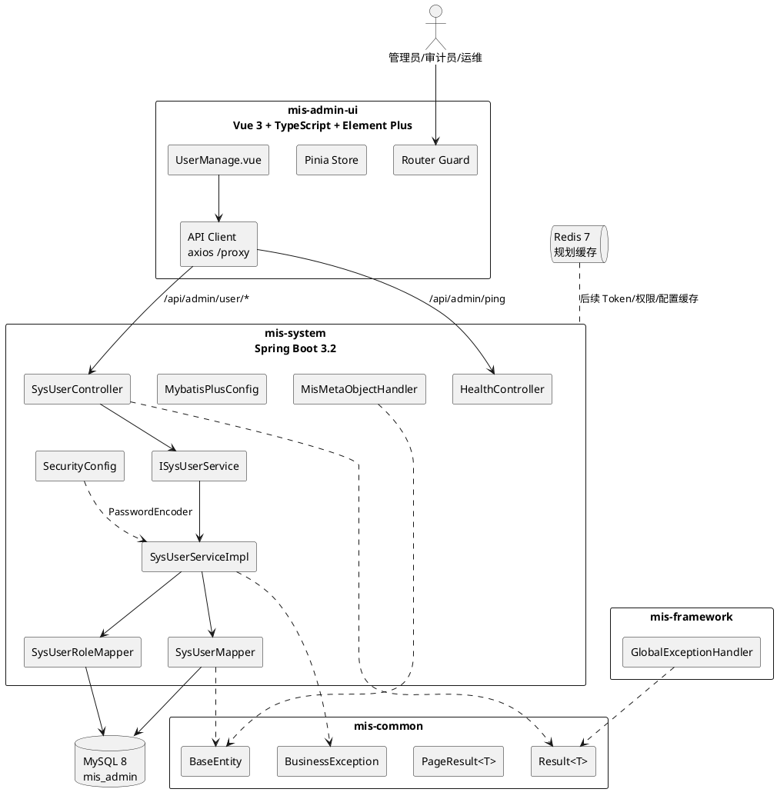
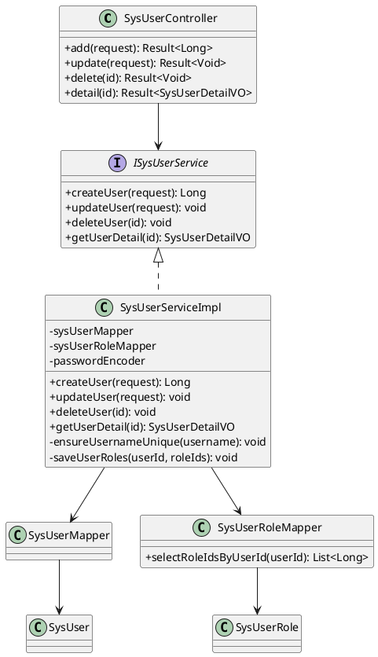
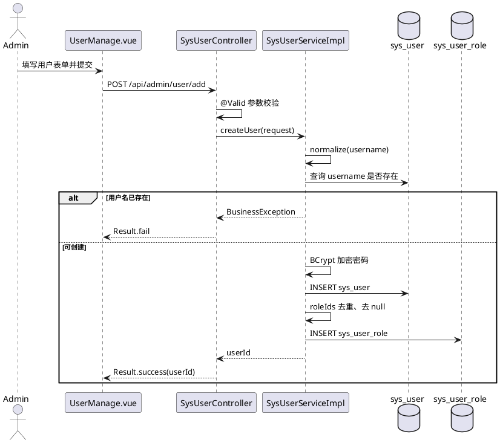

# MIS 系统管理模块-系统架构设计文档

文档版本：V1.0  
编制日期：2026-05-02  
适用项目：MIS 系统管理模块  
逆向依据：`AGENTS.md`、`coding-standards.md`、`api-design.md`、`feature_list.json`、`docs/system-management-srs.md`、Flyway 迁移脚本、`SysUserServiceImpl.java` 等当前代码

## 1. 引言

### 1.1 编写目的

本文档从当前仓库实现反向抽取系统管理模块的总体架构、分层设计、核心模块设计、接口协作、部署运行、安全策略和质量约束，为后续编码、测试、验收和维护提供设计依据。

本文档遵循任务书 3.5 节对设计文档深度的通常要求：不仅描述技术选型，还明确系统边界、模块职责、接口关系、数据库依赖、关键流程、非功能设计、约束与可追踪关系。

### 1.2 系统范围

系统管理模块是 MIS 平台的基础支撑模块，目标覆盖：

| 功能域 | 设计范围 | 当前实现状态 |
| --- | --- | --- |
| 用户管理 | 用户新增、编辑、详情、逻辑删除、角色分配、后续分页与密码管理 | 已实现核心写操作和详情 |
| 角色权限 | RBAC 角色、菜单/按钮权限、用户角色、角色菜单、数据范围 | 已完成表结构和初始数据，业务接口待实现 |
| 部门管理 | 部门树、组织架构、用户部门归属 | 已完成表结构和初始数据，业务接口待实现 |
| 菜单管理 | 动态路由、菜单树、按钮权限标识 | 已完成表结构和初始数据，业务接口待实现 |
| 数据字典 | 字典类型、字典项、状态类枚举 | 已完成表结构和初始数据，业务接口待实现 |
| 操作日志 | 管理端操作审计、异常记录扩展 | 已完成操作日志表，AOP 采集待实现 |
| 系统配置 | 参数配置、密码策略、注册/验证码开关 | 已完成表结构和初始数据，业务接口待实现 |
| 系统监控 | 健康检查、在线用户、资源监控扩展 | 已实现 `/ping` 冒烟接口 |

### 1.3 参考资料

| 编号 | 资料 |
| --- | --- |
| REF-01 | `docs/system-management-srs.md` |
| REF-02 | `AGENTS.md` |
| REF-03 | `coding-standards.md` |
| REF-04 | `api-design.md` |
| REF-05 | `feature_list.json` |
| REF-06 | `mis-system/src/main/resources/db/migration/V1__init_sys_user.sql` 至 `V8__init_relation_tables.sql` |
| REF-07 | `mis-system/src/main/java/com/creator/mis/system/service/impl/SysUserServiceImpl.java` |
| REF-08 | `mis-system/src/main/resources/application.yml`、`docker-compose.yml`、`mis-admin-ui/vite.config.ts` |

## 2. 架构目标与约束

### 2.1 架构目标

| 目标 | 说明 | 当前设计支撑 |
| --- | --- | --- |
| 分层清晰 | 前端、接口层、业务层、数据访问层、公共基础层解耦 | Controller 仅调用 Service，Service 通过 Mapper 访问数据库 |
| 可维护 | 公共响应、基础实体、异常处理、审计字段统一 | `Result<T>`、`BaseEntity`、`GlobalExceptionHandler`、`MisMetaObjectHandler` |
| 可扩展 | 模块按用户、角色、部门、菜单、字典、配置、日志拆分 | 表结构和命名均采用 `sys_*` 前缀 |
| 安全可控 | 密码加密、参数校验、权限标识、逻辑删除 | BCrypt、Jakarta Validation、`sys:{module}:{action}`、MyBatis-Plus 逻辑删除 |
| 可追踪 | 需求、功能进度、迁移脚本、代码实现可对应 | SRS、`feature_list.json`、Flyway V1-V8 |
| 可部署 | 本地可通过 Docker Compose 启动 MySQL/Redis，应用配置环境变量化 | `docker-compose.yml`、`application.yml` |

### 2.2 关键约束

| 约束编号 | 约束内容 | 设计响应 |
| --- | --- | --- |
| CON-01 | Controller 禁止直接操作数据库 | Controller 注入 `ISysUserService`，数据库访问集中在 Service/Mapper |
| CON-02 | 禁止跳过 Service 层直接调用 Mapper 完成业务 | 用户新增、编辑、删除、详情均经 `SysUserServiceImpl` |
| CON-03 | 禁止硬编码散落式权限标识 | 表中 `sys_menu.perms` 统一采用 `sys:user:list` 等格式，后续应抽取常量 |
| CON-04 | 禁止使用 `SELECT *` | 当前自定义 SQL `selectRoleIdsByUserId` 明确选择 `role_id` |
| CON-05 | 禁止硬编码数据库连接信息 | `application.yml` 使用 `MIS_DB_URL`、`MIS_DB_USER`、`MIS_DB_PASSWORD` 环境变量 |
| CON-06 | 系统实体统一 `Sys` 前缀并继承 `BaseEntity` | `SysUser` 已继承，关系表 `SysUserRole` 为轻量关联实体 |
| CON-07 | 写操作必须事务保护 | 用户新增、编辑、删除均使用 `@Transactional(rollbackFor = Exception.class)` |
| CON-08 | API 统一响应 | Controller 返回 `Result<T>` |
| CON-09 | 数据库系统表统一 `sys_` 前缀 | Flyway V1-V8 均满足 |

## 3. 总体架构

### 3.1 架构风格

系统采用前后端分离、单体多模块后端、分层架构和数据库迁移管理组合：

| 层次 | 组件 | 职责 |
| --- | --- | --- |
| 展示层 | `mis-admin-ui` | Vue3 管理后台、路由守卫、请求封装、Element Plus 页面 |
| 接入层 | Vite dev proxy / HTTP | 开发环境把 `/proxy` 转发到后端 `/api/admin` |
| 接口层 | `mis-system` Controller | 接收 REST 请求、参数校验、统一响应 |
| 业务层 | `mis-system` Service | 业务规则、事务边界、跨表写入、异常语义 |
| 数据访问层 | MyBatis-Plus Mapper | CRUD、分页插件、自定义精确查询 |
| 基础层 | `mis-common`、`mis-framework` | 基础实体、响应对象、业务异常、全局异常处理 |
| 数据层 | MySQL 8、Flyway | 业务表、关系表、初始化数据、版本化迁移 |
| 缓存层 | Redis 7 | 当前部署就绪，后续承载 Token、权限、配置和在线用户缓存 |

### 3.2 逻辑架构图

### 3.3 物理部署架构

| 节点 | 组件 | 端口/协议 | 说明 |
| --- | --- | --- | --- |
| 浏览器 | 管理后台 | HTTP/HTTPS | 访问 Vue 单页应用 |
| 前端开发服务 | Vite | `3000` | 开发环境代理 `/proxy` |
| 后端应用 | Spring Boot | `8080`，context-path `/api/admin` | 提供 REST API |
| 数据库 | MySQL 8.0 | `13306:3306` | `mis_admin` 库，Flyway 自动迁移 |
| 缓存 | Redis 7 | `6379` | 当前容器就绪，后续用于权限/配置/在线用户 |

生产部署建议将前端静态资源托管到 Nginx/CDN，后端应用通过网关或反向代理暴露 HTTPS，数据库与缓存只开放内网访问。

## 4. 工程结构设计

### 4.1 后端模块

| Maven 模块 | 类型 | 职责 | 关键类 |
| --- | --- | --- | --- |
| `mis-parent` | 父工程 | 统一版本、Java 17、模块聚合 | `pom.xml` |
| `mis-common` | 公共基础模块 | 通用领域对象、响应模型、异常 | `BaseEntity`、`Result`、`PageResult`、`BusinessException` |
| `mis-framework` | 框架适配模块 | Web 全局异常处理等横切能力 | `GlobalExceptionHandler` |
| `mis-system` | 可运行业务模块 | Controller、Service、Mapper、配置、Flyway | `MisSystemApplication`、`SysUserController`、`SysUserServiceImpl` |

### 4.2 前端结构

| 目录 | 职责 |
| --- | --- |
| `src/api` | axios 实例、业务 API 封装、统一错误处理 |
| `src/router` | Vue Router、登录拦截、页面标题 |
| `src/stores` | Pinia 状态管理 |
| `src/layout` | 管理后台基础布局 |
| `src/views/system/user` | 用户管理页面 |
| `src/types` | API、路由、用户类型定义 |
| `src/utils/auth.ts` | Token 读写工具 |

### 4.3 配置与迁移

| 文件 | 设计作用 |
| --- | --- |
| `application.yml` | 服务端口、context path、数据源、Flyway、MyBatis-Plus 逻辑删除配置 |
| `docker-compose.yml` | 本地 MySQL/Redis 运行环境 |
| `V1__init_sys_user.sql` 至 `V8__init_relation_tables.sql` | 版本化数据库结构与初始化数据 |
| `vite.config.ts` | 前端开发端口和 API 代理 |

## 5. 分层设计

### 5.1 表现层

表现层负责页面交互、表单校验、路由拦截与接口调用。当前实现包括：

| 设计点 | 当前实现 | 后续扩展 |
| --- | --- | --- |
| 路由守卫 | 无 Token 时跳转 `/login` | 接入真实登录、刷新 Token、权限路由 |
| 请求封装 | axios `baseURL=/proxy`、自动注入 `Authorization` | 统一处理业务错误码、无感刷新 |
| 用户页面 | `UserManage.vue` 支持新增、编辑、删除、详情 | 增加分页列表、部门筛选、导入导出 |
| 状态管理 | Pinia 维护用户 profile | 增加权限、菜单、按钮级状态 |

### 5.2 接口层

接口层以 Controller 为边界，负责 REST 映射和参数校验。

| Controller | 路径 | 职责 |
| --- | --- | --- |
| `SysUserController` | `/api/admin/user/*` | 用户新增、编辑、删除、详情 |
| `HealthController` | `/api/admin/ping` | 健康冒烟检查 |

当前接口：

| 方法 | 路径 | 请求对象 | 响应对象 | 说明 |
| --- | --- | --- | --- | --- |
| `POST` | `/user/add` | `SysUserCreateRequest` | `Result<Long>` | 新增用户并返回 ID |
| `PUT` | `/user/update` | `SysUserUpdateRequest` | `Result<Void>` | 编辑用户资料和角色 |
| `DELETE` | `/user/delete/{id}` | Path ID | `Result<Void>` | 逻辑删除用户 |
| `GET` | `/user/detail/{id}` | Path ID | `Result<SysUserDetailVO>` | 用户详情与角色 ID |
| `GET` | `/ping` | 无 | `Result<String>` | 返回 `ok` |

说明：由于 `server.servlet.context-path=/api/admin`，实际完整路径为 `/api/admin/user/add` 等。

### 5.3 业务层

业务层集中处理业务规则和事务。当前用户服务关键规则如下：

| 方法 | 事务 | 核心规则 |
| --- | --- | --- |
| `createUser` | 有 | 用户名 trim、唯一性校验、BCrypt 加密、写入用户、保存角色 |
| `updateUser` | 有 | 校验用户存在、禁止通过编辑接口修改用户名和密码、重建角色关系 |
| `deleteUser` | 有 | 校验用户存在、设置 `deleted=1` |
| `getUserDetail` | 无 | 查询用户基础字段和角色 ID 集合 |

业务层异常统一抛出 `BusinessException`，由全局异常处理器转换为统一响应。

### 5.4 数据访问层

数据访问层使用 MyBatis-Plus：

| 组件 | 作用 |
| --- | --- |
| `BaseMapper<SysUser>` | 提供用户基础 CRUD |
| `BaseMapper<SysUserRole>` | 提供用户角色关系 CRUD |
| `@Select("SELECT role_id ...")` | 明确字段查询用户角色 ID，避免 `SELECT *` |
| `PaginationInnerInterceptor(DbType.MYSQL)` | 支持 MySQL 分页扩展 |
| MyBatis-Plus 逻辑删除 | `deleted=0/1` |

### 5.5 公共与框架层

| 组件 | 设计职责 |
| --- | --- |
| `BaseEntity` | 抽象 `id`、创建/更新审计字段、逻辑删除字段 |
| `Result<T>` | 统一接口响应 `{code,message,data}` |
| `PageResult<T>` | 统一分页响应 `{records,total,size,current,pages}` |
| `BusinessException` | 业务异常语义和错误码 |
| `GlobalExceptionHandler` | 业务异常、参数校验异常、系统异常统一处理 |
| `MisMetaObjectHandler` | 自动填充创建/更新时间和操作人 |

## 6. 核心模块设计

### 6.1 用户管理模块

#### 6.1.1 职责

用户管理模块负责系统账号生命周期管理，包括用户基础信息、密码存储、状态、部门归属和角色关联。

#### 6.1.2 类协作

#### 6.1.3 新增用户流程

#### 6.1.4 删除用户流程

删除用户采用逻辑删除。Service 根据 ID 查询用户，存在时仅更新 `sys_user.deleted=1`，不删除 `sys_user_role` 历史关联记录。后续若需严格清理，应在业务规则中明确是否同步删除关联表。

### 6.2 RBAC 权限模块

当前数据库已具备 RBAC 基础结构：

| 对象 | 表 | 说明 |
| --- | --- | --- |
| 用户 | `sys_user` | 权限主体 |
| 角色 | `sys_role` | 权限集合与数据范围 |
| 菜单/按钮权限 | `sys_menu` | 页面、路由、按钮、权限标识 |
| 用户角色 | `sys_user_role` | 用户和角色多对多 |
| 角色菜单 | `sys_role_menu` | 角色和菜单/按钮多对多 |
| 角色部门 | `sys_role_dept` | 自定义数据范围 |

权限识别建议：

| 层次 | 设计方式 |
| --- | --- |
| 页面权限 | 根据 `sys_menu.menu_type=2` 和 `perms` 生成可访问路由 |
| 按钮权限 | 根据 `sys_menu.menu_type=3` 控制前端按钮显示和后端方法授权 |
| 接口权限 | 后端使用 `@PreAuthorize("hasAuthority('sys:user:add')")` 等方式 |
| 数据权限 | 根据 `sys_role.data_scope` 与 `sys_role_dept` 生成数据过滤条件 |

### 6.3 部门管理模块

`sys_dept` 使用邻接表模型：

| 字段 | 作用 |
| --- | --- |
| `id` | 部门主键 |
| `parent_id` | 父部门 ID，根部门为 0 |
| `dept_code` | 部门编码 |
| `sort_order` | 同级排序 |
| `status` | 启用/禁用 |

树形查询建议按 `parent_id` 一次性加载后在内存组装，或在后续大数据量场景增加路径字段、层级字段和递归查询优化。

### 6.4 菜单管理模块

`sys_menu` 统一承载目录、菜单和按钮：

| `menu_type` | 含义 | 示例 |
| --- | --- | --- |
| `1` | 目录 | 系统管理 |
| `2` | 菜单 | 用户管理 |
| `3` | 按钮 | 用户新增、用户删除 |

菜单路由由 `path`、`component`、`visible`、`is_cache`、`is_frame` 支撑；按钮权限由 `perms` 支撑。

### 6.5 数据字典模块

字典采用类型表与数据表分离：

| 表 | 职责 |
| --- | --- |
| `sys_dict_type` | 定义字典名称和唯一类型编码 |
| `sys_dict_data` | 定义字典标签、值、排序、样式和默认项 |

当前已初始化用户状态、性别、是否状态等基础字典。后续前端表单和表格应从字典接口加载，减少枚举硬编码。

### 6.6 系统配置模块

`sys_config` 以键值方式保存系统参数。当前初始化配置包括站点标题、初始密码、账号注册开关、验证码开关、密码长度限制。后续建议增加配置缓存和刷新接口，系统内置配置由 `config_type=1` 标识并限制删除。

### 6.7 操作日志模块

`sys_log` 设计用于 AOP 自动记录：

| 记录类别 | 字段支撑 |
| --- | --- |
| 操作信息 | `title`、`business_type`、`method`、`request_method` |
| 操作人 | `operator_name`、`operator_type` |
| 请求上下文 | `oper_url`、`oper_ip`、`oper_param` |
| 响应与异常 | `oper_result`、`status`、`error_msg` |
| 性能 | `cost_time`、`create_time` |

建议后续实现 `@Log` 注解和 AOP 切面，避免 Controller 内手工记录。

## 7. 接口与通信设计

### 7.1 API 设计原则

| 原则 | 说明 |
| --- | --- |
| 统一基础路径 | 后端 context path 为 `/api/admin` |
| 模块化路径 | 当前用户模块为 `/user/{action}`，规范建议 `/api/admin/{module}/{action}` |
| 统一响应 | 成功返回 `Result.success`，失败返回 `Result.fail` |
| 统一分页 | 分页使用 `PageResult<T>` |
| 参数校验 | 请求 DTO 使用 Jakarta Validation |
| 权限标识 | `sys:{module}:{action}` |

### 7.2 前后端通信

开发环境通信链路：

1. 浏览器访问 Vite `http://localhost:3000`。
2. 前端 axios 请求 `/proxy/user/add`。
3. Vite 将 `/proxy` 重写为后端 `http://localhost:8080/api/admin`。
4. 后端 Controller 处理 `/api/admin/user/add`。
5. 后端返回 `Result<T>`，前端响应拦截器处理。

### 7.3 错误处理

| 异常类型 | 后端处理 | HTTP 状态 | 业务码 |
| --- | --- | --- | --- |
| `BusinessException(401)` | `GlobalExceptionHandler` | 401 | 401 |
| `BusinessException(403)` | `GlobalExceptionHandler` | 403 | 403 |
| `BusinessException(404)` | `GlobalExceptionHandler` | 404 | 404 |
| 参数校验异常 | `GlobalExceptionHandler` | 400 | 400 |
| 未处理异常 | `GlobalExceptionHandler` | 500 | 500 |

## 8. 数据架构设计

### 8.1 数据域划分

| 数据域 | 表 |
| --- | --- |
| 用户域 | `sys_user`、`sys_user_role` |
| 权限域 | `sys_role`、`sys_menu`、`sys_role_menu`、`sys_role_dept` |
| 组织域 | `sys_dept` |
| 字典域 | `sys_dict_type`、`sys_dict_data` |
| 配置域 | `sys_config` |
| 审计域 | `sys_log` |

### 8.2 数据一致性

| 场景 | 一致性策略 |
| --- | --- |
| 新增用户和角色关系 | 同一事务内先写用户再写用户角色 |
| 编辑用户角色 | 同一事务内删除旧关系再插入新关系 |
| 用户逻辑删除 | 只更新用户表 `deleted`，不物理删除 |
| 角色菜单初始化 | 通过 `INSERT ... SELECT` 给超级管理员授权 |
| 审计字段 | MyBatis-Plus MetaObjectHandler 和数据库默认值双重保障 |

## 9. 安全设计

### 9.1 当前安全措施

| 领域 | 措施 |
| --- | --- |
| 密码存储 | `BCryptPasswordEncoder` 加密 |
| 参数校验 | DTO 使用 `@NotBlank`、`@Size`、`@Email`、`@Pattern` 等 |
| 敏感字段 | 用户详情 VO 不返回密码 |
| 逻辑删除 | MyBatis-Plus `@TableLogic` 和全局配置 |
| 异常输出 | 未处理异常统一返回 `Internal server error`，避免泄漏堆栈 |

### 9.2 待完善安全措施

| 项目 | 设计建议 |
| --- | --- |
| 认证 | 实现 JWT Access Token + Refresh Token，Redis 保存刷新令牌和黑名单 |
| 授权 | 接入 Spring Security Method Security，基于 `sys_menu.perms` 校验 |
| 密码策略 | 从 `sys_config` 读取最小/最大长度、复杂度规则和历史密码策略 |
| 防重放 | 生产环境启用 HTTPS、时间戳、nonce、签名或网关防护 |
| 审计 | 对新增、编辑、删除、授权等关键操作记录 `sys_log` |

## 10. 非功能设计

| 类别 | 设计措施 |
| --- | --- |
| 性能 | MyBatis-Plus 分页插件，常用筛选字段建索引，角色关系表联合唯一索引 |
| 可用性 | Docker Compose 本地依赖，健康检查接口，后续扩展 Spring Actuator |
| 可维护性 | 多模块分层、统一 DTO/VO/Result、Flyway 管理表结构 |
| 可测试性 | `mis-system` 引入 H2 测试配置，Jacoco 对 `SysUserServiceImpl` 设定覆盖率门槛 |
| 可扩展性 | RBAC、字典、配置、日志表已预留，Redis 可扩展缓存能力 |
| 可观测性 | 当前日志级别配置，后续补充操作日志 AOP、指标采集和链路追踪 |

## 11. 运行与部署设计

### 11.1 本地运行依赖

| 组件 | 方式 |
| --- | --- |
| MySQL | `docker compose up -d mysql` |
| Redis | `docker compose up -d redis` |
| 后端 | `mvnw.cmd -pl mis-system spring-boot:run` |
| 前端 | `cd mis-admin-ui && npm run dev` |

### 11.2 环境变量

| 变量 | 默认值 | 说明 |
| --- | --- | --- |
| `MIS_DB_URL` | `jdbc:mysql://localhost:13306/mis_admin...` | 数据库连接 |
| `MIS_DB_USER` | `mis` | 数据库用户 |
| `MIS_DB_PASSWORD` | `mis123` | 数据库密码 |
| `MYSQL_ROOT_PASSWORD` | `devroot` | 本地 MySQL root 密码 |
| `MYSQL_DATABASE` | `mis_admin` | 本地数据库名 |

### 11.3 Flyway 迁移策略

| 配置 | 值 |
| --- | --- |
| `locations` | `classpath:db/migration` |
| `table` | `flyway_schema_history` |
| `baseline-on-migrate` | `true` |
| `validate-on-migrate` | `true` |

新增表结构必须通过新版本迁移脚本提交，例如 `V9__add_login_log.sql`，不得直接修改生产已执行脚本。

## 12. 设计追踪矩阵

| SRS 需求 | 架构设计元素 | 当前证据 |
| --- | --- | --- |
| FR-USER-002 | 用户新增流程、BCrypt、事务 | `SysUserServiceImpl.createUser`、`SecurityConfig` |
| FR-USER-003 | 用户名唯一性校验 | `ensureUsernameUnique`、`uk_sys_user_username` |
| FR-USER-004 | 密码加密 | `PasswordEncoder.encode` |
| FR-USER-005 | 用户编辑 | `updateUser` |
| FR-USER-006 | 用户角色分配 | `saveUserRoles`、`sys_user_role` |
| FR-USER-007 | 逻辑删除 | `deleteUser`、`deleted` 字段 |
| FR-RBAC-001 至 FR-RBAC-007 | RBAC 数据模型 | `sys_role`、`sys_menu`、关系表 |
| FR-ORG-001 | 部门树模型 | `sys_dept.parent_id` |
| FR-DICT-001/002 | 字典类型/数据模型 | `sys_dict_type`、`sys_dict_data` |
| FR-CONFIG-001 | 配置键值模型 | `sys_config` |
| FR-AUDIT-001 | 操作日志模型 | `sys_log` |
| FR-MON-001 | 健康检查 | `HealthController.ping` |

## 13. 风险与改进项

| 编号 | 风险或差距 | 影响 | 建议 |
| --- | --- | --- | --- |
| R-01 | 当前仅有密码加密 Bean，尚未接入完整 Spring Security 认证授权链路 | 登录、接口保护和权限校验不足 | 增加认证接口、JWT Filter、方法级授权 |
| R-02 | 用户删除未同步清理角色关系 | 逻辑删除用户仍保留关系数据 | 明确审计保留策略，必要时逻辑过滤关联查询 |
| R-03 | 关联表未声明外键 | 数据库层不能强制引用完整性 | 可在应用层校验，或根据部署策略增加外键 |
| R-04 | `MisMetaObjectHandler` 操作人固定为 `system` | 审计字段不能反映真实用户 | 接入认证上下文后读取当前登录人 |
| R-05 | API 规范与当前路径仍有细微差异 | 后续接口文档和前端路径可能不一致 | 统一保留 `/api/admin` context path，模块内路径按规范演进 |
| R-06 | Redis 已部署但未使用 | Token、权限、配置缓存尚未落地 | 按认证、权限、配置顺序逐步接入 |

